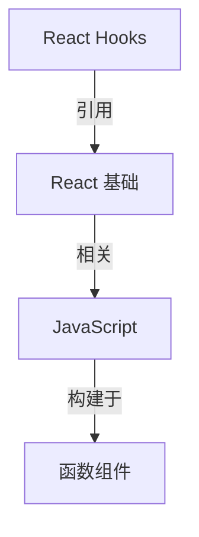
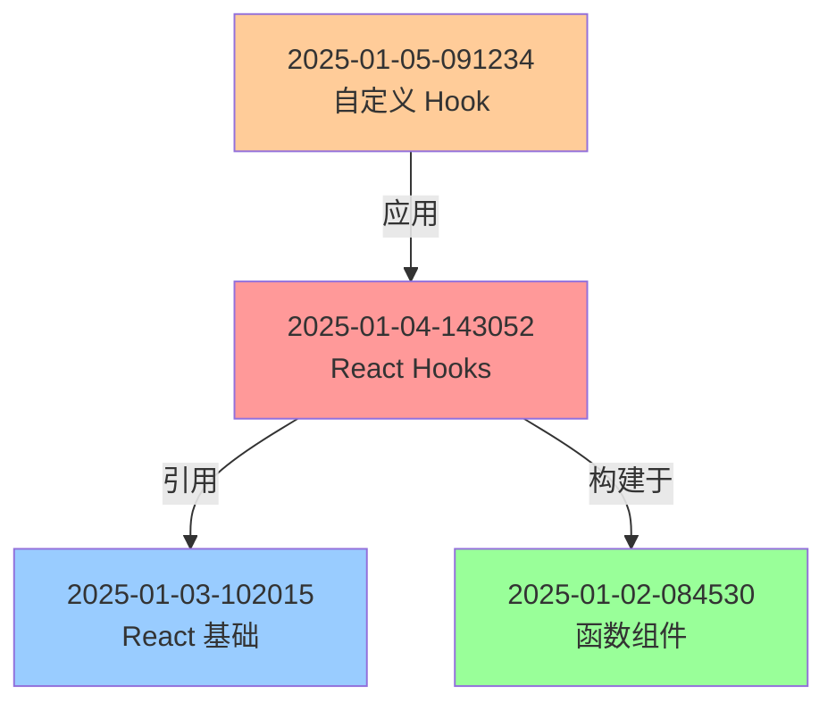
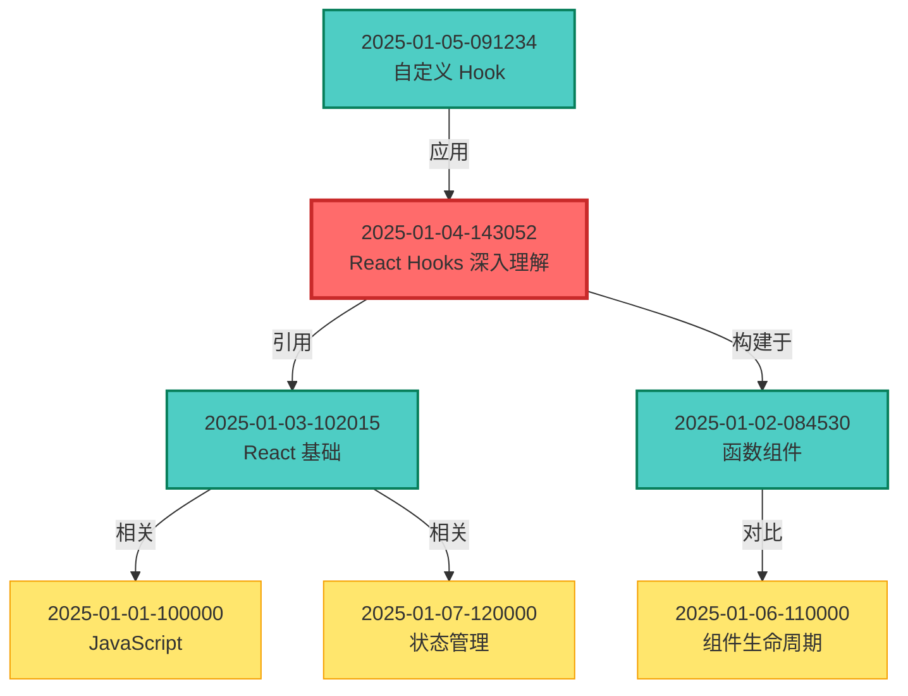
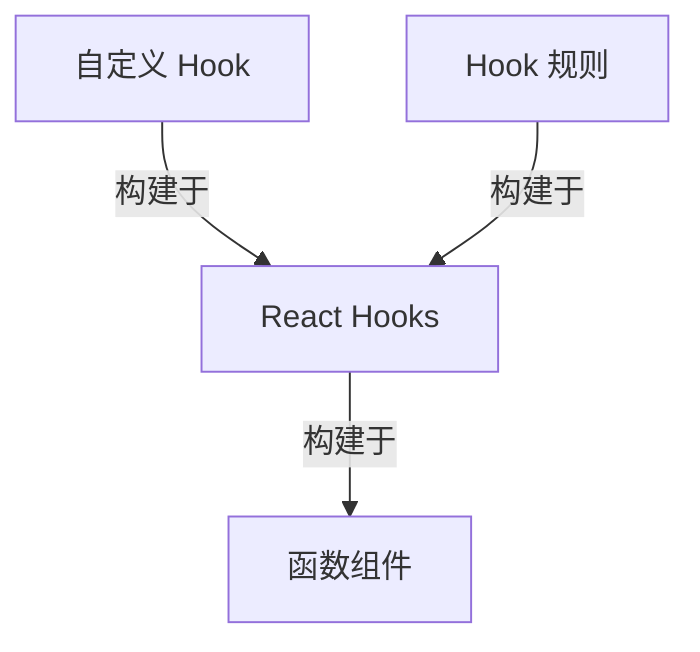
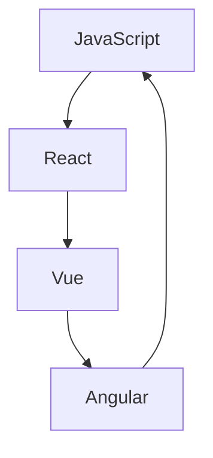

# /kb-graph - 知识图谱可视化

## 功能
生成知识库的关系图谱,支持多种可视化格式,帮助理解知识之间的关联。

## 使用方式

### 基本用法(Mermaid 格式)
```
/kb-graph --format=mermaid

生成 Mermaid 图表代码:

```

### HTML 交互式图谱
```
/kb-graph --format=html

生成 exports/knowledge-graph.html
使用 D3.js 实现交互式可视化
- 点击节点查看详情
- 拖拽调整布局
- 滚轮缩放
```

### 命令行 ASCII 图
```
/kb-graph --format=ascii

[React Hooks]
    |
    |--引用--> [React 基础]
    |              |
    |              |--相关--> [JavaScript]
    |
    |--构建于--> [函数组件]
```

### 聚焦特定条目
```
/kb-graph --focus=2025-01-04-143052 --depth=2

显示以该条目为中心的2层关系网络
```

### 过滤特定类型的关联
```
/kb-graph --filter=builds-on

仅显示"构建于"类型的关联
```

## 参数说明

- `--format`: 输出格式
  - `mermaid`: Mermaid 图表代码(默认)
  - `html`: 交互式 HTML 文件
  - `ascii`: 命令行 ASCII 图

- `--focus`: 聚焦的条目 ID
  - 显示以该条目为中心的关系网络
  - 未指定则显示所有条目

- `--depth`: 关系深度(默认 2)
  - 1: 仅直接关联
  - 2: 直接关联 + 间接关联
  - 3: 更深层的关联网络

- `--filter`: 过滤关联类型
  - `references`: 仅引用关系
  - `builds-on`: 仅构建关系
  - `related`: 仅相关关系
  - `contradicts`: 仅对立关系
  - `example-of`: 仅示例关系
  - `application`: 仅应用关系

## 工作流程

### 1. 读取关系数据
```
从 knowledge/relationships.json 读取:
- nodes: 所有知识节点
- edges: 所有关联边
```

### 2. 构建图谱结构
```
根据参数筛选:
- 应用 --focus 过滤
- 应用 --depth 限制
- 应用 --filter 过滤
```

### 3. 生成可视化
```
根据 --format 生成对应格式:
- mermaid: 生成 Mermaid 语法
- html: 生成 D3.js 可视化
- ascii: 生成 ASCII 艺术字
```

### 4. 输出结果
```
mermaid: 直接显示在终端
html: 保存到 exports/knowledge-graph.html
ascii: 直接显示在终端
```

## 输出格式详解

### Mermaid 格式

#### 优点
- 简洁易读
- 可在支持 Mermaid 的 Markdown 查看器中渲染
- 易于分享和嵌入文档

#### 示例输出
```
/kb-graph --format=mermaid



图谱已生成!包含 4 个节点,3 条边
```

#### 完整示例
```bash
/kb-graph --format=mermaid --focus=2025-01-04-143052 --depth=2



聚焦节点: React Hooks 深入理解
深度: 2 层
节点数: 7 个
边数: 6 条
```

### HTML 格式

#### 优点
- 交互式可视化
- 支持缩放、拖拽
- 点击节点查看详情
- 美观的动画效果

#### 示例代码
```html
<!DOCTYPE html>
<html lang="zh-CN">
<head>
    <meta charset="UTF-8">
    <meta name="viewport" content="width=device-width, initial-scale=1.0">
    <title>知识图谱可视化</title>
    <script src="https://d3js.org/d3.v7.min.js"></script>
    <style>
        body {
            font-family: 'Segoe UI', Tahoma, Geneva, Verdana, sans-serif;
            margin: 0;
            overflow: hidden;
        }
        #graph {
            width: 100vw;
            height: 100vh;
        }
        .node {
            cursor: pointer;
        }
        .node circle {
            stroke: #fff;
            stroke-width: 2px;
        }
        .node text {
            font-size: 12px;
            pointer-events: none;
        }
        .link {
            stroke: #999;
            stroke-opacity: 0.6;
        }
        .link-label {
            font-size: 10px;
            fill: #666;
        }
        .tooltip {
            position: absolute;
            background: rgba(0, 0, 0, 0.8);
            color: white;
            padding: 10px;
            border-radius: 5px;
            pointer-events: none;
            display: none;
        }
    </style>
</head>
<body>
    <div id="graph"></div>
    <div class="tooltip" id="tooltip"></div>

    <script>
        // 图数据
        const graphData = {
            nodes: [
                { id: "2025-01-04-143052", label: "React Hooks", group: "learning" },
                { id: "2025-01-03-102015", label: "React 基础", group: "learning" },
                { id: "2025-01-02-084530", label: "函数组件", group: "code" },
                { id: "2025-01-05-091234", label: "自定义 Hook", group: "code" }
            ],
            links: [
                { source: "2025-01-04-143052", target: "2025-01-03-102015", type: "引用" },
                { source: "2025-01-04-143052", target: "2025-01-02-084530", type: "构建于" },
                { source: "2025-01-05-091234", target: "2025-01-04-143052", type: "应用" }
            ]
        };

        // 创建 SVG
        const svg = d3.select("#graph")
            .append("svg")
            .attr("width", "100%")
            .attr("height", "100%");

        // 创建力导向图
        const simulation = d3.forceSimulation(graphData.nodes)
            .force("link", d3.forceLink(graphData.links).id(d => d.id).distance(100))
            .force("charge", d3.forceManyBody().strength(-300))
            .force("center", d3.forceCenter(window.innerWidth / 2, window.innerHeight / 2));

        // 颜色映射
        const colorScale = d3.scaleOrdinal()
            .domain(["code", "learning", "projects", "personal"])
            .range(["#4ecdc4", "#ff6b6b", "#ffe66d", "#95e1d3"]);

        // 绘制连线
        const link = svg.append("g")
            .selectAll("line")
            .data(graphData.links)
            .join("line")
            .attr("class", "link");

        // 绘制连线标签
        const linkLabel = svg.append("g")
            .selectAll("text")
            .data(graphData.links)
            .join("text")
            .attr("class", "link-label")
            .text(d => d.type);

        // 绘制节点
        const node = svg.append("g")
            .selectAll("g")
            .data(graphData.nodes)
            .join("g")
            .attr("class", "node")
            .call(d3.drag()
                .on("start", dragstarted)
                .on("drag", dragged)
                .on("end", dragended));

        node.append("circle")
            .attr("r", 20)
            .attr("fill", d => colorScale(d.group));

        node.append("text")
            .attr("dy", 30)
            .attr("text-anchor", "middle")
            .text(d => d.label);

        // 添加交互
        node.on("click", function(event, d) {
            alert(`节点: ${d.label}\nID: ${d.id}\n分类: ${d.group}`);
        });

        // 更新位置
        simulation.on("tick", () => {
            link
                .attr("x1", d => d.source.x)
                .attr("y1", d => d.source.y)
                .attr("x2", d => d.target.x)
                .attr("y2", d => d.target.y);

            linkLabel
                .attr("x", d => (d.source.x + d.target.x) / 2)
                .attr("y", d => (d.source.y + d.target.y) / 2);

            node
                .attr("transform", d => `translate(${d.x},${d.y})`);
        });

        // 拖拽函数
        function dragstarted(event, d) {
            if (!event.active) simulation.alphaTarget(0.3).restart();
            d.fx = d.x;
            d.fy = d.y;
        }

        function dragged(event, d) {
            d.fx = event.x;
            d.fy = event.y;
        }

        function dragended(event, d) {
            if (!event.active) simulation.alphaTarget(0);
            d.fx = null;
            d.fy = null;
        }

        // 缩放
        const zoom = d3.zoom()
            .scaleExtent([0.1, 4])
            .on("zoom", (event) => {
                svg.attr("transform", event.transform);
            });

        svg.call(zoom);
    </script>
</body>
</html>
```

#### 使用示例
```bash
/kb-graph --format=html

✅ HTML 交互式图谱已生成!
文件: exports/knowledge-graph.html

打开方式:
  1. 双击文件在浏览器中打开
  2. 或运行: start exports/knowledge-graph.html

功能:
  - 点击节点查看详情
  - 拖拽节点调整布局
  - 滚轮缩放
  - 右键菜单导出图片
```

### ASCII 格式

#### 优点
- 纯文本,无需额外工具
- 快速查看
- 适合终端环境

#### 示例输出
```bash
/kb-graph --format=ascii

知识图谱可视化:

[React Hooks]
    |
    +--引用--> [React 基础]
    |              |
    |              +--相关--> [JavaScript]
    |              |              |
    |              |              +--构建于--> [ES6+]
    |              |
    |              +--相关--> [组件生命周期]
    |
    +--构建于--> [函数组件]
    |               |
    |               +--对比--> [Class 组件]
    |
    +--相关--> [状态管理]

[自定义 Hook]
    |
    +--应用--> [React Hooks]

节点统计:
  总节点: 9 个
  最大深度: 3 层
  孤立节点: 0 个

关联统计:
  引用: 2 个
  构建: 3 个
  相关: 4 个
  总计: 9 条边
```

#### 聚焦模式
```bash
/kb-graph --format=ascii --focus=2025-01-04-143052 --depth=1

聚焦: [React Hooks 深入理解]

直接关联:

├─ 引用 ─→ [React 基础概念]
│
├─ 构建于 ─→ [函数组件]
│
└─ 反向链接 ←─ [自定义 Hook]

该节点:
  出度: 2 个链接
  入度: 1 个反向链接
  总关联: 3 个
```

## 高级功能

### 过滤特定类型
```bash
/kb-graph --filter=builds-on --format=mermaid

仅显示"构建于"关系:


```

### 多种布局算法

#### 星形布局(聚焦模式)
```bash
/kb-graph --focus=2025-01-04-143052 --layout=star

       [函数组件]
            |
            |
[自定义 Hook] -- [React Hooks] -- [React 基础]
            |
            |
       [状态管理]
```

#### 层级布局(按时间)
```bash
/kb-graph --layout=hierarchical --format=mermaid

graph TD
  2025-01-01[JavaScript]
  2025-01-02[函数组件]
  2025-01-03[React 基础]
  2025-01-04[React Hooks]
  2025-01-05[自定义 Hook]

  2025-01-01 --> 2025-01-02
  2025-01-02 --> 2025-01-03
  2025-01-03 --> 2025-01-04
  2025-01-04 --> 2025-01-05
```

#### 环形布局
```bash
/kb-graph --layout=circular --format=mermaid


```

### 导出选项

#### 导出为图片
```bash
/kb-graph --format=html --export=png

生成 exports/knowledge-graph.png
分辨率: 1920x1080
```

#### 导出为 SVG
```bash
/kb-graph --format=html --export=svg

生成 exports/knowledge-graph.svg
可缩放矢量图形
```

#### 嵌入到 Markdown
```bash
/kb-graph --format=mermaid --copy

✅ Mermaid 代码已复制到剪贴板!
可以直接粘贴到 Markdown 文档中
```

## 统计信息

### 图谱分析
```bash
/kb-graph --stats

知识图谱统计:

节点信息:
  总节点数: 45 个
  最大连通分量: 38 个
  孤立节点: 7 个
  中心节点: React Hooks (连接度: 8)

边信息:
  总边数: 63 条
  平均连接度: 2.8
  最常见类型: related (32 条)

分类分布:
  code: 15 个节点
  learning: 18 个节点
  projects: 8 个节点
  personal: 4 个节点

聚类系数:
  整体聚类系数: 0.42
  最大团大小: 5 个节点

路径分析:
  平均路径长度: 2.3
  最长路径: 5
  直径: 5
```

### 关键节点识别
```bash
/kb-graph --central-node

Top 5 关键节点:

1. React Hooks (连接度: 8)
   中心性: 0.85
   作用: 知识网络的核心枢纽

2. JavaScript (连接度: 6)
   中心性: 0.72
   作用: 基础知识

3. React 基础 (连接度: 5)
   中心性: 0.68
   作用: 桥梁节点

4. 状态管理 (连接度: 4)
   中心性: 0.55
   作用: 进阶主题

5. TypeScript (连接度: 4)
   中心性: 0.52
   作用: 类型系统
```

## 实用场景

### 检查知识覆盖
```bash
/kb-graph --format=ascii --focus=react

查看 React 相关知识的覆盖情况:
- 是否有遗漏的重要概念?
- 关联是否合理?
- 是否需要创建新的链接?
```

### 发现学习路径
```bash
/kb-graph --format=mermaid --layout=hierarchical

生成学习路径图:
从基础到高级,按依赖关系排列
适合制定学习计划
```

### 识别知识孤岛
```bash
/kb-graph --find-isolated

发现 5 个孤立节点:
1. CSS Grid (建议关联: Flexbox)
2. WebAssembly (建议关联: JavaScript)
3. GraphQL (建议关联: REST API)
...
```

### 可视化知识演化
```bash
/kb-graph --timeline --format=html

按时间展示知识演化过程:
动画显示每个月新增的节点和边
```

## 注意事项

1. **性能**: 大量节点(>100)时,ASCII 和 Mermaid 格式可能较慢
2. **浏览器兼容**: HTML 格式需要现代浏览器支持
3. **布局调整**: 力导向图布局可能需要手动调整
4. **导出限制**: 导出图片需要额外工具

## 最佳实践

1. **定期查看**: 每周查看知识图谱,了解知识网络变化
2. **清理孤立节点**: 及时为孤立节点创建关联
3. **发现关键节点**: 关注高连接度的节点,它们是知识网络的核心
4. **优化标签**: 通过图谱发现标签使用模式,优化标签体系
5. **学习路径**: 利用图谱制定学习计划,从基础到高级

## 扩展功能(未来)

1. **3D 可视化**: 使用 Three.js 实现 3D 知识图谱
2. **时间轴视图**: 按时间展示知识演化
3. **社区检测**: 自动识别知识社群
4. **智能布局**: 根据内容自动调整布局
5. **主题颜色**: 根据分类或标签自定义颜色
