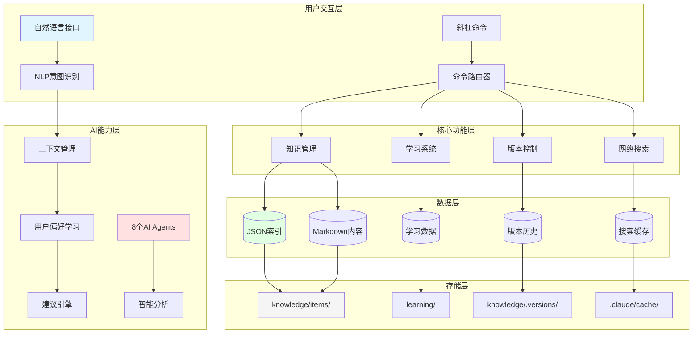
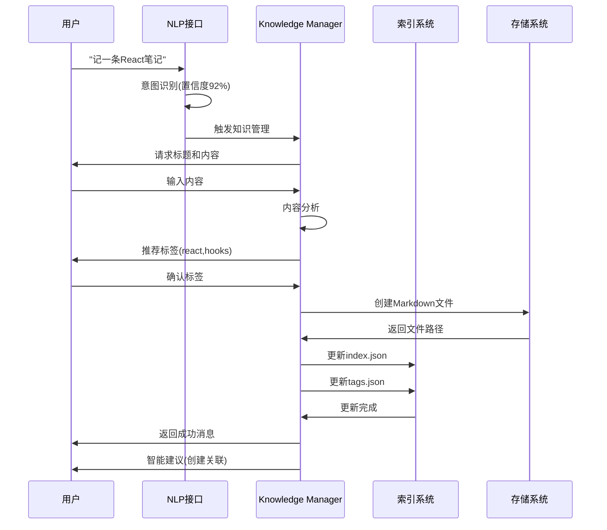
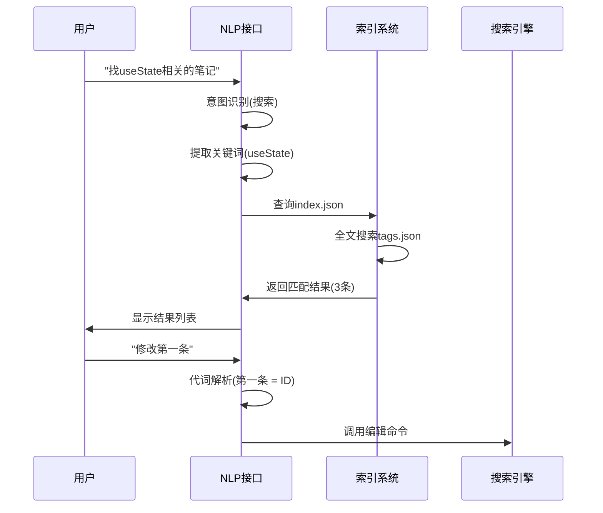

# 🏗️ 系统架构

> 深入了解个人知识系统的技术架构、数据流程和核心组件

## 📑 目录

- [整体架构图](#整体架构图)
- [目录结构](#目录结构)
- [数据流程](#数据流程)
- [核心组件说明](#核心组件说明)
- [技术栈](#技术栈)
- [性能指标](#性能指标)

---

## 整体架构图

系统采用分层架构，从用户交互到数据存储共五层：



### 架构分层说明

#### 1. 用户交互层
- **自然语言接口**: 处理自然语言输入
- **斜杠命令**: 处理传统命令行输入
- **NLP意图识别**: 识别用户意图（6大类型）
- **命令路由器**: 将请求路由到对应功能

#### 2. AI能力层
- **上下文管理**: 维护10轮对话窗口
- **用户偏好学习**: 学习用户行为模式
- **建议引擎**: 主动推荐相关操作
- **8个AI Agents**: 专业智能分析

#### 3. 核心功能层
- **知识管理**: CRUD操作
- **学习系统**: 间隔重复、费曼技巧、测验
- **网络搜索**: Google搜索 + AI整理
- **版本控制**: 版本追踪和恢复

#### 4. 数据层
- **JSON索引**: 快速查询和检索
- **Markdown内容**: 知识条目正文
- **学习数据**: SM-2算法数据
- **版本历史**: 变更追踪

#### 5. 存储层
- 纯文本文件系统
- 按日期分层组织
- Git友好结构

---

## 目录结构

完整的项目目录结构：

```
my-know/
├── .claude/                          # Claude Code配置和AI组件
│   ├── agents/                       # 8个专业AI Agent
│   │   ├── knowledge-architect/      # 知识架构师
│   │   ├── knowledge-enricher/       # 知识增强师
│   │   ├── quiz-master/              # 测验大师
│   │   ├── research-assistant/       # 研究助手
│   │   ├── search-assistant/         # 搜索助手
│   │   ├── student/                  # 学生Agent
│   │   ├── tutor/                    # 导师Agent
│   │   └── version-keeper/           # 版本管理员
│   ├── commands/                     # 19个斜杠命令
│   │   ├── kb-add.md                 # 添加知识
│   │   ├── kb-edit.md                # 编辑知识
│   │   ├── kb-delete.md              # 删除知识
│   │   ├── kb-search.md              # 搜索知识
│   │   ├── kb-list.md                # 列出知识
│   │   ├── kb-from-pdf.md            # PDF导入
│   │   ├── kb-from-url.md            # URL抓取
│   │   ├── kb-from-image.md          # 图片OCR
│   │   ├── kb-import.md              # 批量导入
│   │   ├── kb-export.md              # 导出知识
│   │   ├── kb-link.md                # 创建关联
│   │   ├── kb-graph.md               # 知识图谱
│   │   ├── kb-diff.md                # 版本对比
│   │   ├── kb-restore.md             # 恢复版本
│   │   ├── kb-learn.md               # 学习计划
│   │   ├── kb-quiz.md                # 智能测验
│   │   ├── kb-review.md              # 间隔复习
│   │   ├── kb-teach.md               # 费曼技巧
│   │   └── kb-search-web.md          # 网络搜索
│   ├── skills/                       # 3个可复用Skill
│   │   ├── knowledge-manager/        # 智能知识管理
│   │   ├── nlp-interface/            # 自然语言接口
│   │   └── suggestion-engine/        # 智能建议引擎
│   └── config/                       # Claude配置
│       └── conversation-history/     # 对话历史管理
│
├── knowledge/                        # 知识存储(核心数据)
│   ├── items/                        # 知识条目(按日期组织)
│   │   ├── 2025/
│   │   │   └── 01-January/
│   │   │       └── 2025-01-04-120000.md
│   │   └── 2026/
│   │       └── 01-January/
│   │           ├── 2026-01-04-105644.md
│   │           ├── 2026-01-04-105730.md
│   │           ├── 2026-01-04-105815.md
│   │           └── 2026-01-04-105900.md
│   ├── .versions/                    # 版本历史
│   │   └── 2026-01-04-105815.v1.md
│   ├── index.json                    # 主索引
│   ├── tags.json                     # 标签索引
│   ├── relationships.json            # 关联索引
│   └── learning.json                 # 学习数据
│
├── config/                           # 用户配置
│   ├── user-preferences.json         # 用户偏好
│   └── search-api.json               # 搜索API配置(可选)
│
├── templates/                        # 知识模板
│   ├── learning-note.md              # 学习笔记模板
│   ├── code-snippet.md               # 代码片段模板
│   ├── project-doc.md                # 项目文档模板
│   └── research-note.md              # 研究笔记模板
│
├── learning/                         # 学习资源
├── public/                           # 公共资源
│   └── 社群.jpg                      # 社群二维码
├── exports/                          # 导出目录
├── docs/                             # 详细文档
│   ├── GETTING_STARTED.md            # 快速开始
│   ├── USER_GUIDE.md                 # 使用指南
│   ├── ARCHITECTURE.md               # 系统架构(本文件)
│   ├── CONFIGURATION.md              # 配置说明
│   ├── DEVELOPMENT.md                # 开发指南
│   ├── COMMAND_REFERENCE.md          # 命令参考
│   ├── CHANGELOG.md                  # 更新日志
│   └── ROADMAP.md                    # 发展路线
├── README.md                         # 项目文档
└── LICENSE                           # MIT许可证
```

### 核心目录说明

#### `.claude/` - AI组件目录
所有AI相关的配置和组件：
- **agents/**: 8个专业AI Agent的配置和提示词
- **commands/**: 19个斜杠命令的实现
- **skills/**: 3个可复用的Skill组件
- **config/**: Claude Code的运行时配置

#### `knowledge/` - 知识存储目录
核心数据存储区域：
- **items/**: 按日期组织的知识条目（Markdown格式）
- **.versions/**: 版本历史备份
- **index.json**: 主索引，包含所有条目的元数据
- **tags.json**: 标签索引和频率统计
- **relationships.json**: 知识关联关系
- **learning.json**: SM-2算法学习数据

#### `config/` - 用户配置目录
- **user-preferences.json**: 用户行为偏好和默认设置
- **search-api.json**: Google搜索API密钥（可选）

---

## 数据流程

### 添加知识流程

以自然语言添加知识为例，展示完整的数据流程：



### 搜索知识流程



### 间隔复习流程

```mermaid
sequenceDiagram
    participant U as 用户
    participant R as 复习系统
    participant L as 学习数据
    participant I as 索引系统

    U->>R: /kb-review --today
    R->>L: 查询learning.json
    L->>R: 返回今日复习列表(5条)
    R->>U: 显示第1条
    U->>R: 评分 4/5
    R->>R: 计算下次复习时间(SM-2)
    R->>L: 更新learning.json
    R->>U: 显示第2条
    ...
    R->>U: 复习完成报告
```

---

## 核心组件说明

### 1. 自然语言接口 (NLP Interface)

**文件位置**: `.claude/skills/nlp-interface/skill.md`

**核心功能**:
- **意图识别**: 识别用户意图（6大类型）
  - 添加知识: "记一条笔记", "添加..."
  - 搜索知识: "找...", "搜索..."
  - 编辑知识: "修改...", "编辑..."
  - 学习相关: "开始学习", "测试..."
  - 导入知识: "导入...", "从PDF..."
  - 网络搜索: "搜索网上...", "Google..."

- **参数提取**: 从自然语言提取结构化参数
  - 标题、内容、标签
  - 搜索关键词
  - 时间范围

- **上下文管理**:
  - 维护10轮对话窗口
  - 30分钟会话超时
  - 记忆对话历史

- **代词解析**:
  - "它" → 最新操作的条目ID
  - "这个" → 当前搜索结果
  - "第一条/第三条" → 搜索结果中的序号

**性能指标**:
- 意图识别准确率: 85%+
- 参数提取准确率: 80%+
- 上下文解析准确率: 90%+

### 2. 智能建议引擎

**文件位置**: `.claude/skills/suggestion-engine/skill.md`

**6大建议类型**:

1. **关联建议**
   - 触发时机: 添加知识后
   - 分析维度: 标签相似度、内容相关度
   - 示例: "发现3个React相关条目,建议创建关联"

2. **学习路径**
   - 触发时机: 添加系列知识后
   - 分析维度: 知识图谱拓扑结构
   - 示例: "建议按此顺序学习: React基础 → Hooks → Redux"

3. **薄弱环节**
   - 触发时机: 测验完成后
   - 分析维度: 测验正确率、复习评分
   - 示例: "useMemo掌握不足,建议复习"

4. **搜索细化**
   - 触发时机: 搜索结果过多/过少
   - 分析维度: 结果数量、相关性
   - 示例: "结果过多,建议添加标签过滤"

5. **复习提醒**
   - 触发时机: 每日首次启动
   - 分析维度: 遗忘曲线、到期时间
   - 示例: "今日有5条笔记需要复习"

6. **质量改进**
   - 触发时机: 添加/编辑知识后
   - 分析维度: 内容完整性、格式规范
   - 示例: "建议补充代码示例"

**建议相关性**: 80%+

### 3. 8个AI Agent

#### Knowledge Architect（知识架构师）

**文件位置**: `.claude/agents/knowledge-architect/AGENT.md`

**核心功能**:
- 分析知识结构
- 识别知识空白
- 优化知识组织

**触发方式**:
```bash
@knowledge-architect "分析我的知识结构"
```

#### Knowledge Enricher（知识增强师）

**文件位置**: `.claude/agents/knowledge-enricher/AGENT.md`

**核心功能**:
- 增强内容质量
- 补充信息
- 改进格式

**触发方式**:
```bash
@knowledge-enricher "完善这条笔记"
```

#### Quiz Master（测验大师）

**文件位置**: `.claude/agents/quiz-master/AGENT.md`

**核心功能**:
- 生成智能测验
- 评估掌握程度
- 难度自适应

**触发方式**:
```bash
/kb-quiz "React" --difficulty=medium
```

#### Research Assistant（研究助手）

**文件位置**: `.claude/agents/research-assistant/AGENT.md`

**核心功能**:
- 深度研究主题
- 综合多个来源
- 生成研究报告

**触发方式**:
```bash
@research-assistant "研究微前端架构"
```

#### Search Assistant（搜索助手）

**文件位置**: `.claude/agents/search-assistant/AGENT.md`

**核心功能**:
- 网页内容抓取
- 关键信息提取
- 质量评分

**触发方式**:
```bash
/kb-search-web "React性能优化"
```

#### Student（学生Agent）

**文件位置**: `.claude/agents/student/AGENT.md`

**核心功能**:
- 模拟学习过程
- 主动提问
- 验证理解

**触发方式**:
```bash
/kb-learn "React" --duration=2weeks
```

#### Tutor（导师Agent）

**文件位置**: `.claude/agents/tutor/AGENT.md`

**核心功能**:
- 个性化指导
- 学习建议
- 进度跟踪

**触发方式**:
```bash
/kb-teach "useState" --role=teacher
```

#### Version Keeper（版本管理员）

**文件位置**: `.claude/agents/version-keeper/AGENT.md`

**核心功能**:
- 追踪知识演化
- 对比版本差异
- 分析变更历史

**触发方式**:
```bash
@version-keeper "查看演化历史"
```

---

## 技术栈

### 存储层
- **JSON + Markdown**: 纯文本存储,无数据库依赖
- **文件系统**: 按日期分层组织
- **Git友好**: 天然支持版本控制

### AI引擎
- **Claude Code CLI**: Anthropic官方AI命令行工具
- **Claude API**: GPT-4级别的语言理解能力
- **上下文窗口**: 支持10轮对话记忆

### 搜索
- **Google Custom Search API**: 可选的网络搜索
- **全文索引**: JSON索引 + 标签索引
- **多维度过滤**: 标签、分类、时间

### 学习算法
- **SuperMemo SM-2**: 间隔重复算法
- **费曼技巧**: 主动学习验证
- **自适应测验**: 难度动态调整

### 平台支持
- **Windows**: 原生支持
- **Linux**: 原生支持
- **macOS**: 原生支持

---

## 性能指标

### 意图识别
- **准确率**: 85%+
- **响应时间**: <500ms
- **支持意图**: 6大类型

### 参数提取
- **准确率**: 80%+
- **复杂句式**: 支持多参数组合

### 上下文解析
- **准确率**: 90%+
- **对话窗口**: 10轮
- **会话时间**: 30分钟

### 建议系统
- **相关性**: 80%+
- **响应时间**: <300ms

### 数据规模
- **推荐规模**: 1,000-10,000条目
- **最大支持**: 10,000+条目（本地JSON索引）

### 响应时间
- **意图识别**: <500ms
- **知识搜索**: <200ms
- **智能建议**: <300ms
- **网络搜索**: 2-5秒（含AI整理）

---

## 扩展性设计

### 水平扩展
- 新增AI Agent: 在`.claude/agents/`创建新目录
- 新增命令: 在`.claude/commands/`创建新文件
- 新增Skill: 在`.claude/skills/`创建新目录

### 数据扩展
- 新增索引: 在`knowledge/`创建新的JSON文件
- 新增模板: 在`templates/`创建新模板
- 导入格式: 扩展`/kb-import`支持的源格式

### 功能扩展
- 网络搜索: 可集成其他搜索引擎（Bing、DuckDuckGo）
- 学习算法: 可替换为其他间隔重复算法
- AI模型: 可切换到其他LLM（需修改Skill）

---

## 安全性

### 数据隐私
- 所有数据存储在本地
- 不上传任何内容到云端
- 完全掌控你的知识

### 访问控制
- 基于文件系统的权限
- 支持加密存储（未来）
- 无网络依赖（核心功能）

---

## 📚 相关文档

- [快速开始](GETTING_STARTED.md) - 安装和配置
- [使用指南](USER_GUIDE.md) - 功能详解
- [配置说明](CONFIGURATION.md) - 自定义配置
- [开发指南](DEVELOPMENT.md) - 扩展开发

---

**了解架构，更好地使用系统！** 🚀
